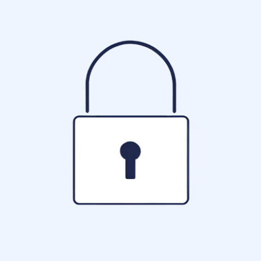

# TapLock

[](https://android-arsenal.com/api?level=31)
[](https://opensource.org/licenses/Apache-2.0)
[](https://github.com/modelorona/TapLock/releases)
[](https://kotlinlang.org)
[](https://developer.android.com/studio)



A minimalist Android widget that lets you lock your screen with a double tap. Perfect for one-handed use and quick screen locking.

## Why TapLock?

While there are several screen-locking apps available on the Play Store, they all share a concerning characteristic: they're closed source while requiring significant system permissions. 

The Accessibility Service permission, which is necessary for screen locking functionality, is particularly powerful - it can:

- Monitor all your interactions with apps
- View your screen content
- Track your inputs and gestures
- Access sensitive information

With closed-source applications, you're essentially trusting unknown code with these extensive capabilities. You have no way to verify:
- What data they're actually collecting
- Where that data might be sent
- What other hidden functionalities might exist
- How securely they handle their permissions

TapLock solves this trust problem through radical transparency:
- 100% open source - every line of code is visible and auditable
- No internet permissions - physically cannot transmit data
- Minimal, focused codebase - easy to review and verify
- Uses Accessibility Service solely for screen locking - nothing else
- No analytics, no tracking, no data collection
- No unnecessary permissions or features

You don't have to trust our privacy claims - you can verify them yourself in the source code. This is the key advantage of open-source security: trust through transparency.

## Features

- 🔒 Lock screen with double tap
- 🎯 Customizable double-tap timeout
- 🔍 Transparent widget - doesn't interfere with your home screen aesthetics
- 🛡️ Minimal permissions - only uses accessibility service for screen locking
- 📱 Resizable widget
- 🎨 Material Design 3 UI
- 🔒 Privacy focused - collects no personal data

## Getting Started

### Requirements
- Android 12 (API 31) or higher
- 1MB of free space

### Installation

1. Download the application from [Google Play](https://play.google.com/store/apps/details?id=com.ah.taplock) or F-Droid (coming soon!)
2. Add the widget to your home screen:
    - Long press on your home screen
    - Select "Widgets"
    - Find "TapLock" in the list
    - Drag and drop the widget to your desired location
3. Enable the Accessibility Service when prompted
4. Double tap the widget to lock your screen

### Configuration

1. Open the TapLock app
2. Adjust the double-tap timeout in Settings (default: 300ms)
3. The widget is transparent by default and can be resized to your preference

## Building from Source

1. Clone the repository:
```bash
git clone https://github.com/modelorona/TapLock.git
```

2. Open the project in Android Studio Hedgehog or later

3. Build the project:
```bash
./gradlew assembleDebug
```

## Privacy

TapLock is designed with privacy in mind:
- No internet connectivity required
- No data collection
- Minimal permissions (only Accessibility Service)
- Open source for transparency

## Contributing

Contributions are welcome! Please feel free to submit a Pull Request.

## License

This project is licensed under the Apache License 2.0 - see the LICENSE file for details